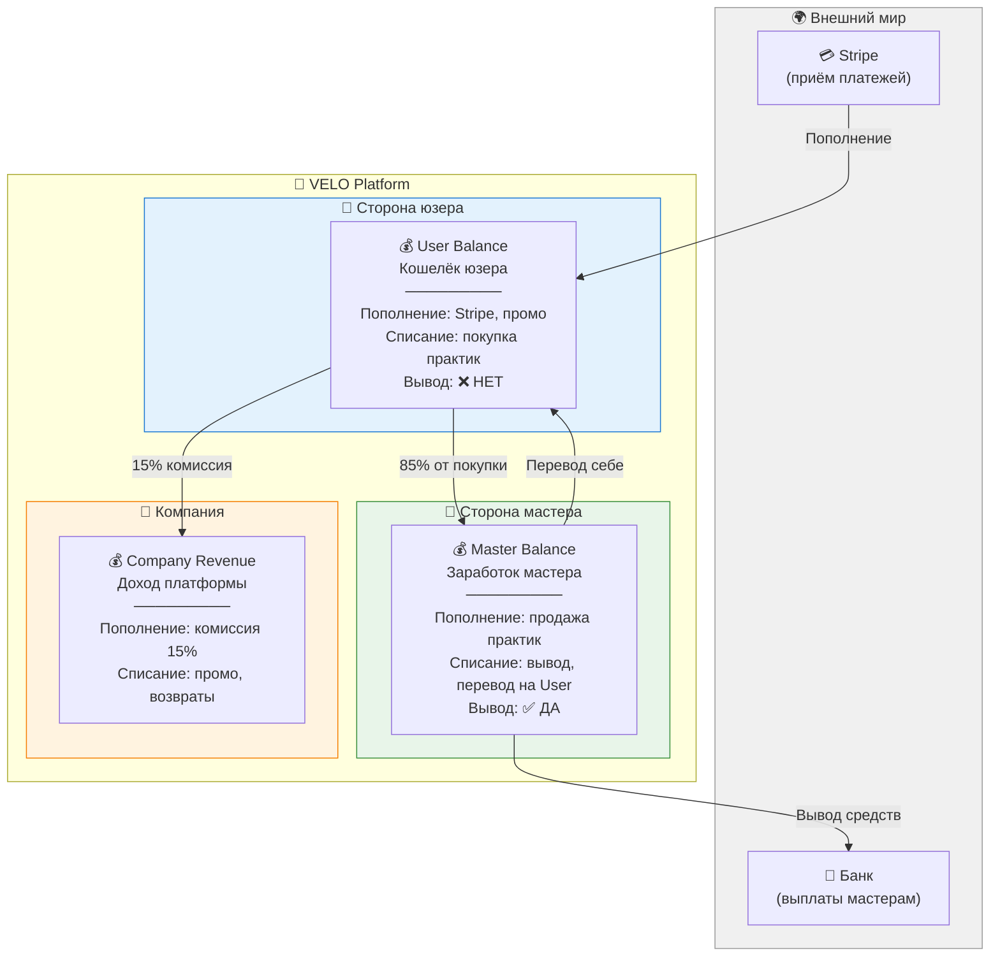
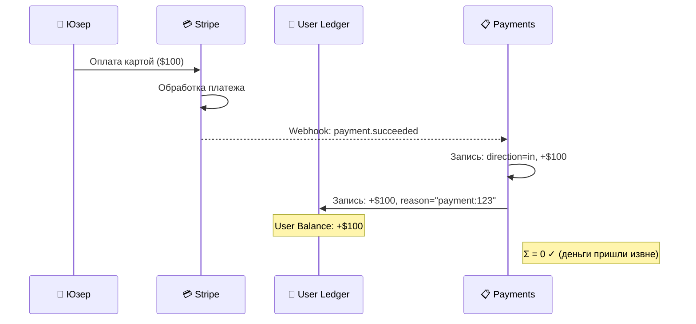
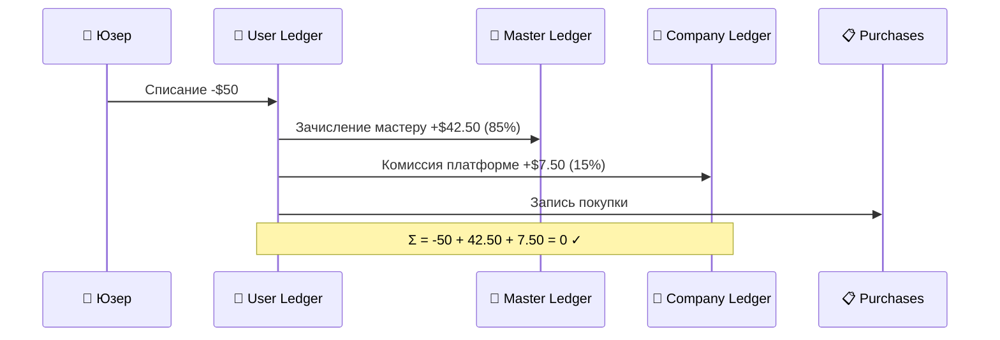
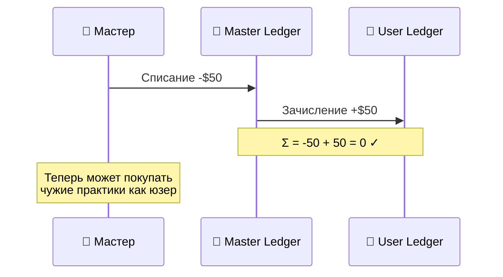
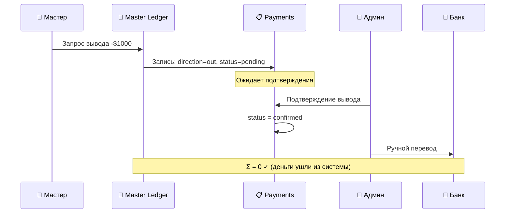
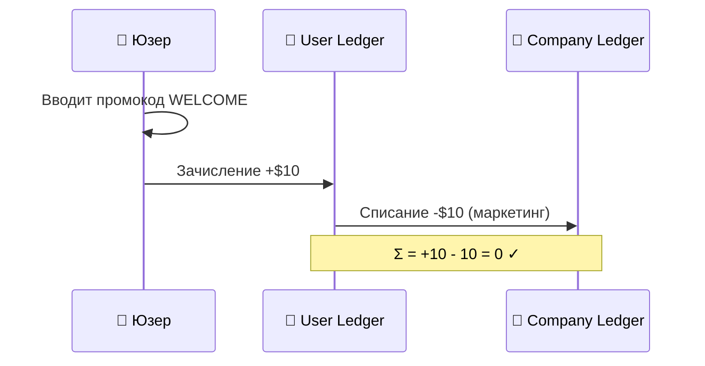
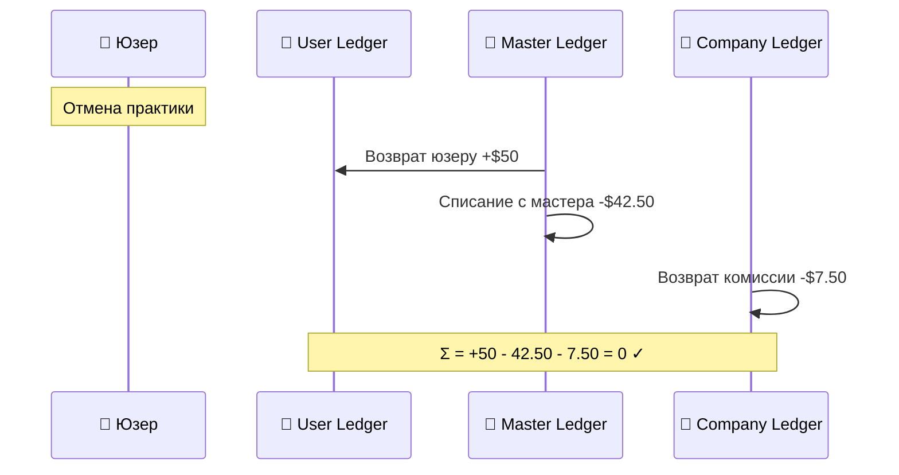

# VELO — Система платежей и журналирования

**Материалы для обсуждения с заказчиком**  
**Дата:** 5 февраля 2026

---

## 1. Общая архитектура: как устроены деньги в системе

### Принцип: Double-Entry (Двойная запись)

> **Каждая копейка отслеживается. Если где-то записалось — где-то списалось.**
>
> Сумма всех операций в системе ВСЕГДА = 0.

Это бухгалтерский стандарт. Исключает "потерянные" деньги, делает аудит тривиальным.

### Схема счетов



### Три журнала (Ledgers)

| Журнал | Владелец | Что хранит |
|--------|----------|------------|
| `user_ledger` | Каждый юзер | Все движения по кошельку юзера |
| `master_ledger` | Каждый мастер | Все движения по счёту мастера |
| `company_ledger` | Платформа | Все комиссии, маркетинг, возвраты |

**Баланс = сумма всех записей в журнале.** Не хранится отдельно, а пересчитывается автоматически. Расхождения невозможны.

---

## 2. Разделение ролей

> **Master Balance — это ЗАРАБОТОК. User Balance — это КОШЕЛЁК.**
>
> Никогда не смешиваем.

| | User Balance | Master Balance |
|--|-------------|----------------|
| **Пополнение** | Stripe, промокоды, перевод с Master | Продажи практик |
| **Траты** | Покупка практик | Перевод на User Balance, вывод |
| **Вывод наружу** | ❌ Нельзя | ✅ Можно |
| **Есть у кого** | У всех | Только у мастеров |

**Мастер, покупающий чужую практику, действует КАК ЮЗЕР:**
- Сначала переводит деньги Master → User Balance
- Потом покупает как обычный юзер
- В отчётности — чистое разделение ролей

---

## 3. Все финансовые операции (double-entry)

### 3.1. Пополнение баланса (Stripe → User)



**Записи в системе:**
```
payments:     direction=in, amount=+100, status=confirmed
user_ledger:  user_id=1, amount=+100, reason="payment:123"
──────────────────────────────────────────────────
Σ = 0 ✓ (деньги вошли в систему извне)
```

---

### 3.2. Покупка практики ($50, комиссия 15%)



**Записи в системе:**
```
user_ledger:    user_id=1, amount=-50.00, reason="purchase:practice=456"
master_ledger:  user_id=2, amount=+42.50, reason="sale:practice=456"
company_ledger: amount=+7.50, type=commission, reason="commission:practice=456"
purchases:      user_id=1, practice_id=456, amount=50.00
──────────────────────────────────────────────────
Σ = -50 + 42.50 + 7.50 = 0 ✓
```

---

### 3.3. Бесплатная практика (price = $0)

> **Даже бесплатные практики создают записи в журналах.**
> Иначе таблицы практик и платежей не бьются.

```
user_ledger:    user_id=1, amount=0, reason="purchase:practice=789"
master_ledger:  user_id=2, amount=0, reason="sale:practice=789"
company_ledger: amount=0, type=commission, reason="commission:practice=789"
purchases:      user_id=1, practice_id=789, amount=0
──────────────────────────────────────────────────
Σ = 0 ✓
```

**Зачем:** отчётность консистентна. `COUNT(purchases)` = все участники. Воронка "бесплатные → платные" работает из коробки.

---

### 3.4. Мастер переводит себе на User Balance



**Записи в системе:**
```
master_ledger:  user_id=2, amount=-50, reason="transfer:internal"
user_ledger:    user_id=2, amount=+50, reason="transfer:internal"
──────────────────────────────────────────────────
Σ = -50 + 50 = 0 ✓
```

---

### 3.5. Вывод средств мастером



**Записи в системе:**
```
master_ledger:  user_id=2, amount=-1000, reason="withdrawal:payment=789"
payments:       direction=out, user_id=2, amount=1000, status=pending
──────────────────────────────────────────────────
Σ = 0 ✓ (деньги покидают систему)
```

**Важно:** выводы подтверждает админ вручную. Автоматических выплат нет.

---

### 3.6. Промокод / реферальный бонус



**Записи в системе:**
```
user_ledger:    user_id=1, amount=+10, reason="promo:WELCOME"
company_ledger: amount=-10, type=marketing, reason="promo:WELCOME"
──────────────────────────────────────────────────
Σ = +10 - 10 = 0 ✓
```

**Company платит за маркетинг.** Это отражается в отчётности как расход.

---

### 3.7. Возврат



**Записи в системе:**
```
user_ledger:    user_id=1, amount=+50, reason="refund:practice=456"
master_ledger:  user_id=2, amount=-42.50, reason="refund:practice=456"
company_ledger: amount=-7.50, type=refund, reason="refund:practice=456"
──────────────────────────────────────────────────
Σ = +50 - 42.50 - 7.50 = 0 ✓
```

---

## 4. Вопросы для обсуждения

### ✅ Решённые (предлагаем утвердить)

| # | Решение | Обоснование |
|---|---------|-------------|
| 1 | **Double-entry журналирование** | Бухгалтерский стандарт, невозможны "потерянные" деньги |
| 2 | **Три журнала** (user, master, company) | Чёткое разделение: кошелёк, заработок, доход платформы |
| 3 | **Master Balance ≠ User Balance** | Разные роли, разные правила, чистая отчётность |
| 4 | **User Balance без вывода** | Юзер может только тратить, не выводить |
| 5 | **Мастер покупает как юзер** | Перевод M→U, потом покупка. Не смешиваем роли |
| 6 | **Бесплатные = нулевые записи** | Консистентность отчётности |
| 7 | **Комиссия 15%** | Фиксированная, на стороне платформы |
| 8 | **Вывод — ручной** | Админ подтверждает, потом банковский перевод |
| 9 | **Stripe для пополнений** | Надёжно, международные карты |

---

### ❓ Открытые (нужно решение)

#### Вопрос 1: Политика отмен юзером

> Юзер отменяет бронь. Когда возвращаем деньги?

| Вариант | Правило |
|---------|---------|
| **A (простой)** | > 24ч до практики = 100% возврат. < 24ч = 0% |
| **B (гибкий)** | > 24ч = 100%. 2-24ч = 50%. < 2ч = 0% |
| **C (жёсткий)** | > 48ч = 100%. < 48ч = 0% |

**Наша рекомендация:** Вариант A. Просто, понятно юзерам, легко реализовать.

---

#### Вопрос 2: Мастер отменяет практику

> Мастер отменил практику, на которую записались 10 человек.

| Вариант | Правило |
|---------|---------|
| **A** | Автоматический 100% возврат всем |
| **B** | Автоматический возврат + штраф мастеру |

**Наша рекомендация:** Вариант A для MVP. Штрафы — позже, когда поймём масштаб проблемы.

---

#### Вопрос 3: No-show (юзер не пришёл)

> Юзер оплатил, но не явился на практику.

| Вариант | Правило |
|---------|---------|
| **A** | Деньги остаются у мастера. Юзер сам виноват. |
| **B** | Автовозврат через 24ч если мастер не отметил attendance |

**Наша рекомендация:** Вариант A. Мастер подготовился, место было занято.

---

#### Вопрос 4: Подарочные сертификаты

> Юзер A хочет подарить юзеру B оплату практики.

| Вариант | Правило |
|---------|---------|
| **A (MVP)** | Не реализуем, розетка в коде |
| **B (MVP)** | Промокод на сумму, Company оплачивает |
| **C (позже)** | Полноценные сертификаты User A → User B |

**Наша рекомендация:** Вариант A. Розетка. Не MVP.

---

#### Вопрос 5: Реферальная программа

> Кто-то приводит нового юзера/мастера. Кто получает бонус?

| Вариант | Правило |
|---------|---------|
| **A (MVP)** | Не реализуем, розетка |
| **B (простой)** | Юзер привёл юзера → оба получают $5 (Company платит) |
| **C (сложный)** | Многоуровневая: юзер→юзер, мастер→мастер, % от покупок |

**Наша рекомендация:** Вариант A. Структура ledger уже поддерживает любой вариант. Реализуем когда будет product-market fit.

---

#### Вопрос 6: Минимальная сумма вывода

| Вариант | Сумма |
|---------|-------|
| **A** | $10 |
| **B** | $50 |
| **C** | Без лимита |

**Наша рекомендация:** Вариант B ($50). Не гоняем мелкие переводы, но и не мешаем новым мастерам.

---

#### Вопрос 7: Комиссия за вывод

| Вариант | Правило |
|---------|---------|
| **A** | 0% (платформа не берёт). Stripe fee за счёт мастера. |
| **B** | Фиксированная ($2 за вывод) |
| **C** | Процент (1-2%) |

**Наша рекомендация:** Вариант A. Не усложняем MVP.

---

#### Вопрос 8: Заморозка средств при бронировании

> Юзер покупает практику, которая через неделю. Списываем сразу?

| Вариант | Правило |
|---------|---------|
| **A (простой)** | Списание сразу. Политика возвратов защищает от злоупотреблений. |
| **B (hold)** | Заморозка на user_balance. Списание после завершения практики. |

**Наша рекомендация:** Вариант A. Hold усложняет логику (pending amounts, частичные балансы). Политика отмен решает проблему проще.

---

## 5. Что даёт эта архитектура в будущем

Текущая структура уже поддерживает (без изменения схемы БД):

| Фича | Как реализуется |
|------|----------------|
| **Подписки** | Stripe subscription → user_ledger (periodic) |
| **Рефералки** | company_ledger → user_ledger (бонус) |
| **Подарочные сертификаты** | user_ledger A → user_ledger B |
| **Кэшбэк** | company_ledger → user_ledger (% от покупки) |
| **Штрафы мастерам** | master_ledger → company_ledger |
| **Групповые скидки** | Изменение суммы в purchase |
| **Разная комиссия для мастеров** | Процент в master_profile, не захардкожен |

---

**Конец документа**
