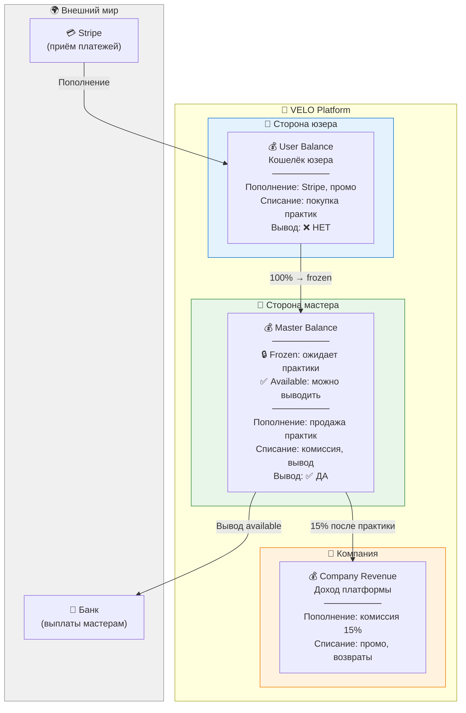
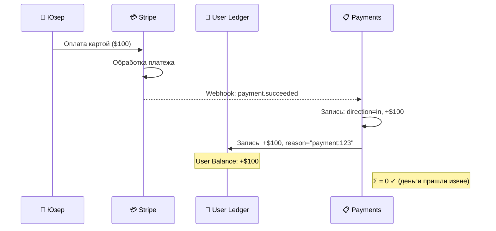
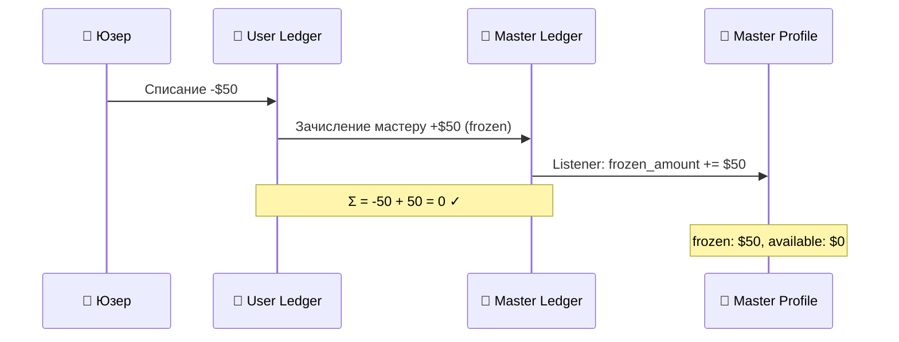
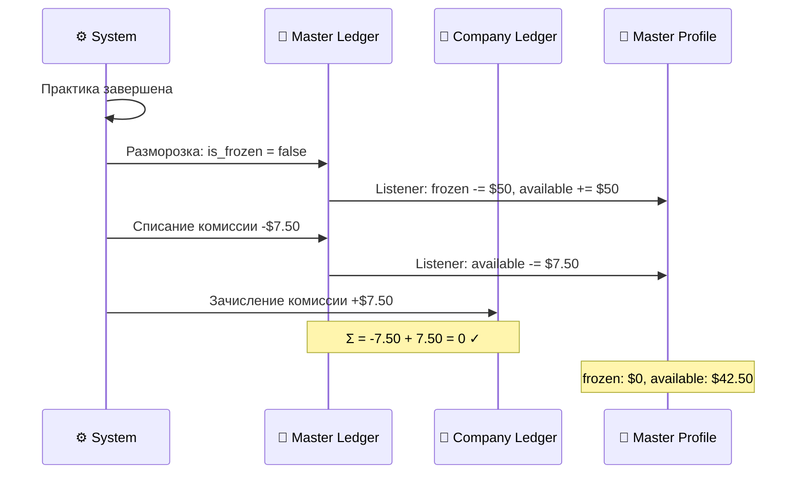
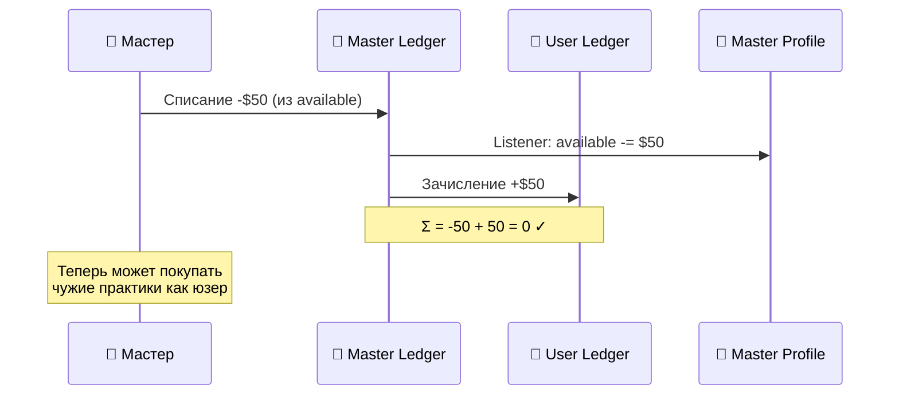
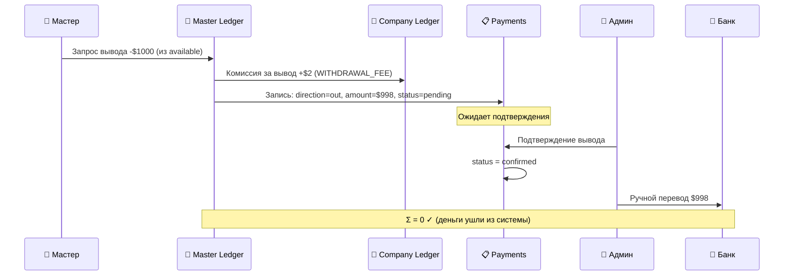
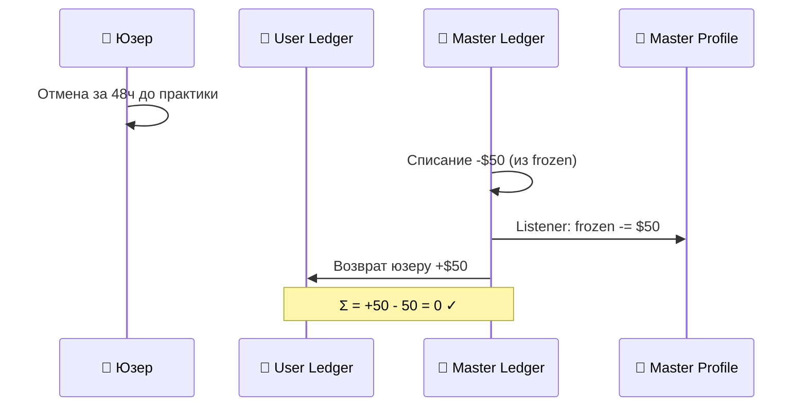
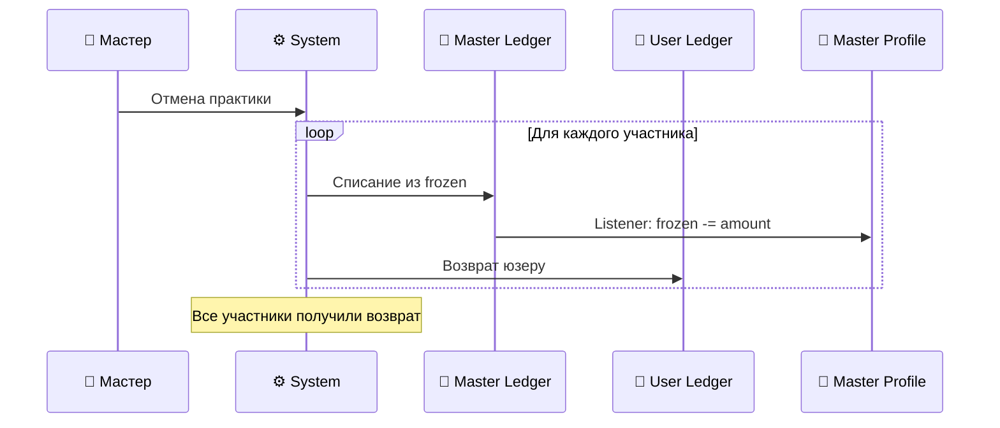
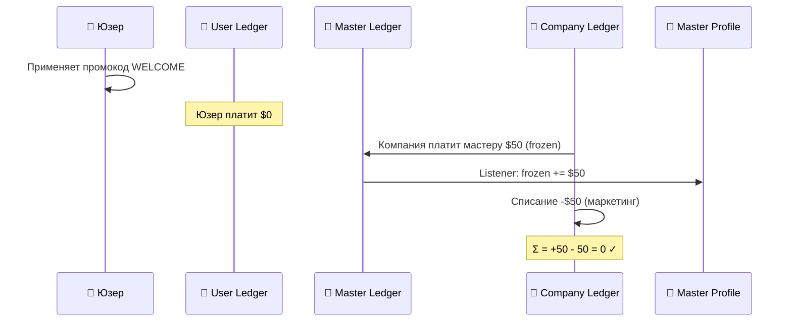

# VELO — Система платежей и журналирования

**Материалы для обсуждения с заказчиком**  
**Дата:** 6 февраля 2026  
**Статус:** ✅ Утверждено

> **Freshness (ПРОМТ №510, 2026-07-19, verified against `8d4948f` on `test`):** graded
> STALE-BUT-HARMLESS overall — NOT rewritten this round. One addition this pass: §8 below,
> a current operational risk (Stripe stub mode) this document previously never mentioned.
> Everything else is UNVERIFIED as of this pass.

---

## 1. Общая архитектура: как устроены деньги в системе

### Принцип: Double-Entry (Двойная запись)

> **Каждая копейка отслеживается. Если где-то записалось — где-то списалось.**
>
> Сумма всех операций в системе ВСЕГДА = 0.

Это бухгалтерский стандарт. Исключает "потерянные" деньги, делает аудит тривиальным.

### Схема счетов



### Три журнала (Ledgers)

| Журнал | Владелец | Что хранит |
|--------|----------|------------|
| `user_ledger` | Каждый юзер | Все движения по кошельку юзера |
| `master_ledger` | Каждый мастер | Все движения по счёту мастера (frozen + available) |
| `company_ledger` | Платформа | Все комиссии, маркетинг, возвраты |

**Баланс = сумма всех записей в журнале.** Дополнительно в профиле мастера хранятся два поля для быстрого доступа: `frozen_amount` и `available_amount`, обновляемые листенерами при каждой записи в ledger.

---

## 2. Разделение ролей

> **Master Balance — это ЗАРАБОТОК. User Balance — это КОШЕЛЁК.**
>
> Никогда не смешиваем.

| | User Balance | Master Balance |
|--|-------------|----------------|
| **Пополнение** | Stripe, промокоды, перевод с Master | Продажа практик (сначала frozen) |
| **Траты** | Покупка практик | Комиссия компании, вывод |
| **Вывод наружу** | ❌ Нельзя | ✅ Можно (только available) |
| **Есть у кого** | У всех | Только у мастеров |

### Master Balance: Frozen vs Available

| | Frozen | Available |
|--|--------|-----------|
| **Когда появляется** | Юзер оплатил практику | Практика успешно завершена |
| **Можно вывести** | ❌ Нет | ✅ Да |
| **Можно перевести на User Balance** | ❌ Нет | ✅ Да |
| **При отмене практики** | Возвращается юзеру | — |

**Мастер, покупающий чужую практику, действует КАК ЮЗЕР:**
- Сначала переводит деньги из Available → User Balance
- Потом покупает как обычный юзер
- В отчётности — чистое разделение ролей

---

## 3. Все финансовые операции (double-entry)

### 3.1. Пополнение баланса (Stripe → User)



**Записи в системе:**
```
payments:     direction=in, amount=+100, status=confirmed
user_ledger:  user_id=1, amount=+100, reason="payment:123"
──────────────────────────────────────────────────
Σ = 0 ✓ (деньги вошли в систему извне)
```

---

### 3.2. Покупка практики ($50)

> **Ключевой принцип: Юзер платит Мастеру 100%. Мастер платит Компании 15% ПОСЛЕ практики.**

#### Шаг 1: Регистрация на практику (деньги замораживаются)



**Записи в системе:**
```
user_ledger:    user_id=1, amount=-50.00, reason="purchase:practice=456"
master_ledger:  user_id=2, amount=+50.00, is_frozen=true, reason="sale:practice=456"
purchases:      user_id=1, practice_id=456, amount=50.00, status=pending
──────────────────────────────────────────────────
Master Profile: frozen_amount += 50, available_amount unchanged
Σ = -50 + 50 = 0 ✓
```

#### Шаг 2: Практика завершена (разморозка + комиссия)



**Записи в системе:**
```
master_ledger:  user_id=2, UPDATE is_frozen=false WHERE practice=456
master_ledger:  user_id=2, amount=-7.50, reason="commission:practice=456"
company_ledger: amount=+7.50, type=commission, reason="commission:practice=456"
purchases:      practice_id=456, UPDATE status=completed
──────────────────────────────────────────────────
Master Profile: frozen_amount = 0, available_amount = 42.50
Σ = -7.50 + 7.50 = 0 ✓
```

---

### 3.3. Бесплатная практика (price = $0)

> **Комиссия компании = 15% от живых денег. Нет денег = нет комиссии.**

```
user_ledger:    user_id=1, amount=0, reason="purchase:practice=789"
master_ledger:  user_id=2, amount=0, is_frozen=true, reason="sale:practice=789"
purchases:      user_id=1, practice_id=789, amount=0, status=pending
──────────────────────────────────────────────────
После завершения практики:
master_ledger:  UPDATE is_frozen=false
company_ledger: (нет записи — комиссия $0)
──────────────────────────────────────────────────
Σ = 0 ✓
```

**Зачем нулевые записи:** отчётность консистентна. `COUNT(purchases)` = все участники. Воронка "бесплатные → платные" работает из коробки.

---

### 3.4. Мастер переводит себе на User Balance

> **Только из Available. Frozen переводить нельзя.**



**Записи в системе:**
```
master_ledger:  user_id=2, amount=-50, reason="transfer:internal"
user_ledger:    user_id=2, amount=+50, reason="transfer:internal"
──────────────────────────────────────────────────
Master Profile: available_amount -= 50
Σ = -50 + 50 = 0 ✓
```

---

### 3.5. Вывод средств мастером

> **Только из Available. Минимальная сумма и комиссия — настраиваемые.**



**Записи в системе:**
```
master_ledger:  user_id=2, amount=-1000, reason="withdrawal:payment=789"
company_ledger: amount=+2, type=withdrawal_fee, reason="withdrawal:payment=789"
payments:       direction=out, user_id=2, amount=998, status=pending
──────────────────────────────────────────────────
Master Profile: available_amount -= 1000
Σ = 0 ✓ (деньги покидают систему)
```

**Важно:** выводы подтверждает админ вручную. Автоматических выплат нет.

---

### 3.6. Отмена и возврат

#### 3.6a. Юзер отменяет бронирование

> **> 24ч до практики = 100% возврат. < 24ч = 0% возврат.**

**Отмена > 24ч (возврат):**



**Записи в системе:**
```
master_ledger:  user_id=2, amount=-50, reason="refund:practice=456"
user_ledger:    user_id=1, amount=+50, reason="refund:practice=456"
purchases:      practice_id=456, UPDATE status=cancelled
──────────────────────────────────────────────────
Master Profile: frozen_amount -= 50
Σ = +50 - 50 = 0 ✓
```

**Отмена < 24ч (без возврата):**
- Деньги остаются в frozen у мастера
- После времени практики — стандартная разморозка + комиссия
- Юзер предупреждён о политике при покупке

---

#### 3.6b. Мастер отменяет практику

> **Автоматический 100% возврат всем участникам.**



**Записи в системе (для каждого участника):**
```
master_ledger:  user_id=2, amount=-50, reason="refund:practice=456,cancelled_by_master"
user_ledger:    user_id=N, amount=+50, reason="refund:practice=456"
──────────────────────────────────────────────────
Σ = 0 ✓
```

---

#### 3.6c. No-show (юзер не пришёл)

> **Деньги остаются у мастера. Стандартный flow завершения практики.**

Юзер не явился — это не вина мастера. Практика считается завершённой, деньги размораживаются, мастер платит комиссию как обычно.

---

### 3.7. Промокоды

В системе существуют **два типа** промокодов с разной финансовой логикой.

#### 3.7a. Company Promo (компания платит за маркетинг)

> **Мастер получает деньги из маркетингового бюджета компании.**
>
> Принцип: "комиссия только с живых денег" — если юзер заплатил $0, комиссия = $0.

Сценарий: компания выпускает промокод WELCOME (100% скидка).
Практика стоит $50, юзер платит $0.



**Записи в системе (скидка 100%):**
```
user_ledger:    user_id=1, amount=$0, reason="purchase:practice=456,promo:WELCOME"
master_ledger:  user_id=2, amount=+$50, is_frozen=true, reason="sale:practice=456,promo:WELCOME"
company_ledger: amount=-$50, type=marketing, reason="promo:WELCOME,practice=456"
purchases:      user_id=1, practice_id=456, amount=$50, discount=$50, status=pending
──────────────────────────────────────────────────
После завершения практики:
master_ledger:  UPDATE is_frozen=false
company_ledger: (комиссия $0 — юзер заплатил $0 живых денег)
──────────────────────────────────────────────────
Master Profile: frozen → available = $50
Σ = 0 ✓
```

**Записи в системе (скидка 50%):**
```
user_ledger:    user_id=1, amount=-$25, reason="purchase:practice=456,promo:WELCOME"
master_ledger:  user_id=2, amount=+$50, is_frozen=true, reason="sale:practice=456"
company_ledger: amount=-$25, type=marketing, reason="promo:WELCOME,practice=456"
purchases:      user_id=1, practice_id=456, amount=$50, discount=$25, status=pending
──────────────────────────────────────────────────
После завершения практики:
master_ledger:  UPDATE is_frozen=false
master_ledger:  amount=-$3.75, reason="commission:practice=456"
company_ledger: amount=+$3.75, type=commission (15% от $25 живых денег)
──────────────────────────────────────────────────
Master Profile: frozen=0, available=$46.25
Σ = 0 ✓
```

---

#### 3.7b. Master Promo (мастер сам отказывается от выручки)

> **Промокод создаёт сам мастер. Компания ничего не платит.**
>
> Кейс: участник уже оплатил мастеру вне платформы.

Сценарий: мастер создал промокод ALEX-VIP (100% скидка).
Практика стоит $50.

**Записи в системе (скидка 100%):**
```
user_ledger:    user_id=1, amount=$0, reason="purchase:practice=456,promo:ALEX-VIP"
master_ledger:  user_id=2, amount=$0, is_frozen=true, reason="sale:practice=456,promo:ALEX-VIP"
purchases:      user_id=1, practice_id=456, amount=$0, status=pending
──────────────────────────────────────────────────
После завершения практики:
master_ledger:  UPDATE is_frozen=false
company_ledger: (комиссия $0 — живых денег $0)
──────────────────────────────────────────────────
Σ = 0 ✓
```

**Записи в системе (скидка 50%):**
```
user_ledger:    user_id=1, amount=-$25, reason="purchase:practice=456,promo:ALEX-VIP"
master_ledger:  user_id=2, amount=+$25, is_frozen=true, reason="sale:practice=456,promo:ALEX-VIP"
purchases:      user_id=1, practice_id=456, amount=$25, status=pending
──────────────────────────────────────────────────
После завершения практики:
master_ledger:  UPDATE is_frozen=false
master_ledger:  amount=-$3.75, reason="commission:practice=456"
company_ledger: amount=+$3.75, type=commission (15% от $25)
──────────────────────────────────────────────────
Master Profile: frozen=0, available=$21.25
Σ = 0 ✓
```

**Ключевые правила Master Promo:**
- Мастер **осознанно** создаёт промокод и принимает снижение выручки
- Промокод действует на **все практики** мастера
- Доступные градации скидки: **5% / 25% / 50% / 75% / 100%**
- Комиссия компании = 15% от **фактически уплаченной** суммы

---

#### Сводная таблица: два типа промокодов

| | Company Promo | Master Promo |
|--|--------------|--------------|
| **Кто создаёт** | Админ / Компания | Мастер |
| **Кто платит за скидку** | Компания (маркетинг) | Мастер (снижает свой доход) |
| **Мастер получает** | Полную цену (из маркетинга) | Только то, что заплатил юзер |
| **Комиссия платформы** | 15% от живых денег юзера | 15% от живых денег юзера |
| **Назначение** | Привлечение юзеров, акции | Доступ для тех, кто оплатил вне платформы |
| **Градации скидки** | Любая (настраивает админ) | 5% / 25% / 50% / 75% / 100% |
| **Область действия** | Настраивается | Все практики мастера |

---

## 4. Принятые решения

### ✅ Архитектурные решения

| # | Решение | Обоснование |
|---|---------|-------------|
| 1 | **Double-entry журналирование** | Бухгалтерский стандарт, невозможны "потерянные" деньги |
| 2 | **Три журнала** (user, master, company) | Чёткое разделение: кошелёк, заработок, доход платформы |
| 3 | **Master Balance: frozen + available** | Два поля в профиле + листенеры для быстрого доступа |
| 4 | **Юзер → Мастер 100%, Мастер → Компания 15%** | Деньги сразу у мастера (frozen), комиссия после практики |
| 5 | **Комиссия только с живых денег** | $0 от юзера = $0 комиссия. Пространство для фрода закроем позже |
| 6 | **User Balance без вывода** | Юзер может только тратить, не выводить |
| 7 | **Мастер покупает как юзер** | Перевод Available → User Balance, потом покупка |
| 8 | **Бесплатные = нулевые записи** | Консистентность отчётности |
| 9 | **Вывод — ручной** | Админ подтверждает, потом банковский перевод |
| 10 | **Stripe для пополнений** | Надёжно, международные карты |
| 11 | **Два типа промокодов** | Company Promo + Master Promo с разной логикой |

---

### ✅ Бизнес-правила

| # | Вопрос | Решение |
|---|--------|---------|
| 1 | **Отмена юзером** | > 24ч = 100% возврат, < 24ч = 0% |
| 2 | **Отмена мастером** | Автоматический 100% возврат всем |
| 3 | **No-show юзера** | Деньги остаются у мастера, стандартный flow |
| 4 | **Подарочные сертификаты** | 🔌 Розетка. Позже: User A → User B |
| 5 | **Реферальная программа** | 🔌 Розетка |
| 6 | **Минимальная сумма вывода** | Настраиваемая: `MIN_WITHDRAWAL_AMOUNT` |
| 7 | **Комиссия за вывод** | Настраиваемая: `WITHDRAWAL_FEE` (может быть 0) |
| 8 | **Заморозка при бронировании** | Списание с юзера сразу → frozen у мастера |
| 9 | **Комиссия при Master Promo** | 15% от фактически уплаченной суммы |

---

## 5. Настраиваемые переменные

| Переменная | Описание | Значение по умолчанию |
|------------|----------|----------------------|
| `PLATFORM_COMMISSION_PERCENT` | Комиссия платформы с продаж | 15% |
| `MIN_WITHDRAWAL_AMOUNT` | Минимальная сумма для вывода | $50 |
| `WITHDRAWAL_FEE` | Комиссия за вывод (фикс.) | $2 (может быть 0) |
| `CANCELLATION_DEADLINE_HOURS` | За сколько часов можно отменить с возвратом | 24 |
| `MASTER_PROMO_DISCOUNTS` | Доступные скидки для Master Promo | [5, 25, 50, 75, 100] |

---

## 6. Что даёт эта архитектура в будущем

Текущая структура уже поддерживает (без изменения схемы БД):

| Фича | Как реализуется |
|------|----------------|
| **Подписки** | Stripe subscription → user_ledger (periodic) |
| **Рефералки** | company_ledger → user_ledger (бонус) |
| **Подарочные сертификаты** | user_ledger A → user_ledger B |
| **Кэшбэк** | company_ledger → user_ledger (% от покупки) |
| **Штрафы мастерам** | master_ledger (available) → company_ledger |
| **Групповые скидки** | Изменение суммы в purchase |
| **Разная комиссия для мастеров** | Процент в master_profile, не захардкожен |

---

## 7. Розетки (заглушки для будущих фич)

| Фича | Статус | Приоритет |
|------|--------|-----------|
| Подарочные сертификаты (User → User) | 🔌 Розетка | После MVP |
| Реферальная программа | 🔌 Розетка | После MVP |
| Штрафы мастерам за отмены | 🔌 Розетка | По мере необходимости |
| Антифрод (злоупотребление промокодами) | 🔌 Розетка | По мере необходимости |

---

## 8. Известный операционный риск: Stripe stub-режим

**Добавлено ПРОМТ №510, 2026-07-19.** Топап (§3.1) имеет два режима, переключаемых
`STRIPE_SECRET_KEY`:

- **Реальный ключ** — обычный Stripe Checkout, webhook подтверждает оплату.
- **Stub-режим** (`STRIPE_SECRET_KEY=TEST`) — Stripe полностью пропускается,
  `payments/stripe.py::_create_stub_topup` мгновенно подтверждает топап без реального
  платежа. Задуман только для TEST-стенда.

Guard против случайного прод-деплоя в stub-режиме уже реализован:
`Settings.is_stripe_stub_blocked` (`backend/app/core/config.py`) поднимает `RuntimeError`
при старте (`backend/app/main.py`, `lifespan()`), если одновременно: не dev-окружение,
`is_stripe_stub` (ключ = `TEST`) и `allow_stripe_stub` НЕ выставлен.

**Текущее состояние прода (owner-measured 2026-07-17, commit `8d4948f`):** прод сейчас
работает с `STRIPE_SECRET_KEY=TEST` и БЕЗ `ALLOW_STRIPE_STUB` — то есть ровно в том
состоянии, которое guard должен блокировать. Прод не падает только потому, что текущий
задеплоенный билд старше этого guard'а. **Следующий прод-релиз с этим guard'ом откажется
стартовать**, пока прод-окружение не будет исправлено: либо реальный Stripe-ключ, либо явный
`ALLOW_STRIPE_STUB=true`, если stub-режим на проде действительно нужен дольше.

Это не баг в коде — это факт окружения, который нужно закрыть до релиза `test` → `main`.

---

**Конец документа**
